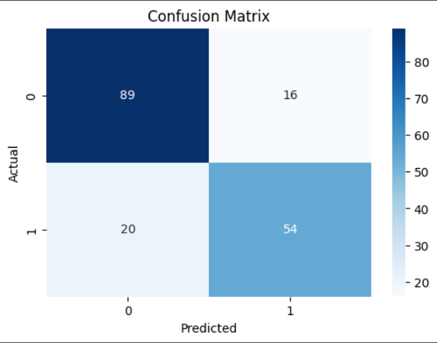

# Titanic ML Project 🚢
Logistic regression model to predict Titanic passenger survival.

This project applies **logistic regression** to predict survival outcomes of passengers on the Titanic. The goal is to build a machine learning model that classifies passengers as either survived (1) or not survived (0) based on key features.

---

## 📌 Project Description

- The dataset is sourced from the famous **Titanic dataset** (available on Kaggle / open data sources).
- The model uses logistic regression to classify survival.
- Features used:  
  - Pclass (Passenger Class)  
  - Sex  
  - Age  
  - SibSp (Siblings/Spouses aboard)  
  - Parch (Parents/Children aboard)  
  - Fare  
  - Embarked (Port of Embarkation)

---

## ⚙️ Libraries Used

- `pandas`
- `numpy`
- `matplotlib`
- `seaborn`
- `scikit-learn`

---

## 📝 Steps Performed

1. Loaded and explored the dataset.
2. Handled missing values:
   - Filled `Age` with median.
   - Filled `Embarked` with mode.
   - Dropped `Cabin` (too many missing values).
3. Converted categorical features (`Sex`, `Embarked`) to numeric.
4. Trained a logistic regression model.
5. Evaluated using accuracy, confusion matrix, classification report, and ROC curve.

---

## 📈 Sample Results

✅ **Accuracy:** ~78% (can vary depending on train-test split)

✅ **Confusion Matrix:**  
|   | Predicted No | Predicted Yes |
|---|--------------|---------------|
| **Actual No** | TN | FP |
| **Actual Yes** | FN | TP |

 
